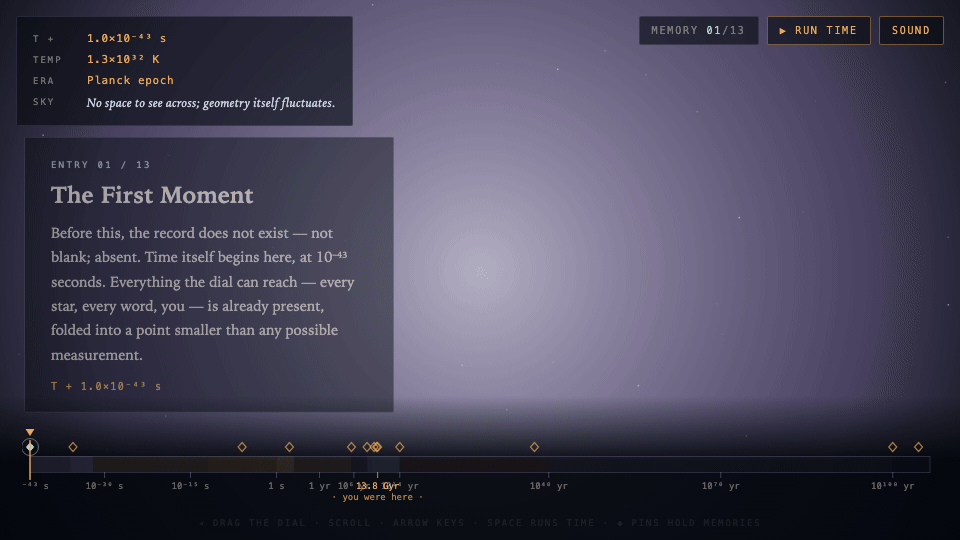

# The Last Observatory 🔭

**Live: [chrisjz.github.io/the-last-observatory](https://chrisjz.github.io/the-last-observatory/)**

An instrument at the end of time.

You are standing after the last black hole has evaporated, operating an archive
machine that holds the complete memory of the universe. One logarithmic dial
spans **157 orders of magnitude** — from the Planck epoch (10⁻⁴³ seconds) to
past the evaporation of the last black hole (10¹⁰⁰ years). Turn it, and the
universe's history renders live around you.

Thirteen moments are pinned in the record. Find them in any order; the final
entry changes depending on how many you've read.

## Controls

| Input | Action |
| --- | --- |
| Drag the dial / scroll anywhere | Move through time |
| `←` `→` (hold `Shift` for coarse) | Fine scrub |
| `Space` | Run time forward automatically |
| `M` | Toggle sound |
| Click a ◆ pin | Jump to that memory |

**Deep links** — append `#lt=<log₁₀ of seconds>` to jump straight to a moment,
skipping the intro: [`#lt=13.08`](https://chrisjz.github.io/the-last-observatory/#lt=13.08)
opens at first light, [`#lt=107.5`](https://chrisjz.github.io/the-last-observatory/#lt=107.5)
at the evaporation of the last black hole.

## How it works

A single self-contained HTML file — no dependencies, no build step, no network
requests.

- **Time axis** — the dial position maps linearly to log₁₀(t/seconds) over
  [−43, 114].
- **Temperature** — the universe's temperature is interpolated in log–log space
  through known anchor points (10³² K at the Planck epoch, 10¹⁵ K at the
  electroweak scale, 3,000 K at recombination, 2.725 K today, decaying toward
  the de Sitter floor in the far future). It drives the plasma's blackbody
  color and the optional audio drone's pitch.
- **Eras** — each cosmological era (inflation, nucleosynthesis, the photon
  epoch, the dark ages, cosmic dawn, the stelliferous / degenerate / black hole
  / dark eras) has its own canvas renderer, cross-faded by log-time weight.
- **Honesty** — speculative physics (proton decay) is labeled as conjecture in
  the text.

## Running locally

Open `index.html` in a browser. That's it.

## License

[MIT](LICENSE)
